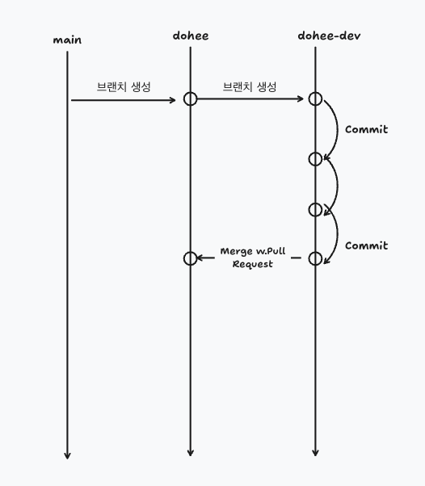

# 온보딩 과제 프로젝트

본격적인 사내 작업을 수행하기 이전에 적응하기 위한 프로젝트입니다.

## 유의 사항

- 우선은 next.js 환경의 작업 난이도를 낮추기위해, 모든 새로운 페이지 파일의 최상단에는 'use client'를 붙여서 작성해주세요. 참고: [use client](https://nextjs.org/docs/app/api-reference/directives/use-client)

## 작업 규칙

### 브랜치 규칙

- 최초로 설정된 main 브랜치의 HEAD에 본인의 이름으로 브랜치명을 생성합니다. (하기부터는 dohee 브랜치라고 표현하겠음.)
- dohee 브랜치의 suffix로 -dev를 붙여서 브랜치를 생성합니다.
- dohee-dev 브랜치에서 작업사항을 커밋해가며 작업을 진행합니다.
  - 가급적이면 작업 단위를 작게 쪼개서 커밋하는것을 권장합니다.
- 작업이 완료되면 dohee 브랜치로 PR을 생성합니다.
  - `base: dohee`, `compare: dohee-dev`로 설정되어 있는것에 유의해주세요.
  - 리뷰어를 `AlangGY` + 다른 팀원 1명을 지정해주세요.
  - PR 예시: 
- 해당 PR을 통해 코드 리뷰를 진행합니다.
- 코드 리뷰가 완료되면 dohee 브랜치로 merge를 진행합니다.

### 커밋 규칙

- 커밋 메시지는 한글로 작성합니다.
- 작업 사항에 따라 prefix를 붙여서 작성합니다.

### 커밋 prefix 종류

- [`feat`] : 일반적으로 디자인 작업을 포함한 코드 작업을 수행할때 사용합니다. (e.g. `feat: TodoListItem 컴포넌트 추가` )
- [`fix`] : 의도치 않은 문제를 해결하고자 하는 커밋일때 사용합니다. (e.g. `fix: 할일 추가가 되지 않는 문제 수정` )
- [`docs`] : 문서화작업을 할때 사용합니다. (e.g. `docs: 커밋 규칙 문서 추가` )
- [`refactor`] : 기존의 코드를 개선하고자 하는 작업을 할때 사용합니다. (e.g. `refactor: 컴포넌트 이름 변경` )
- [`config`] : 프로젝트 또는 프레임워크에 대한 설정 작업을 할때 사용합니다. (e.g. `config: tailwind theme 설정 추가` )
